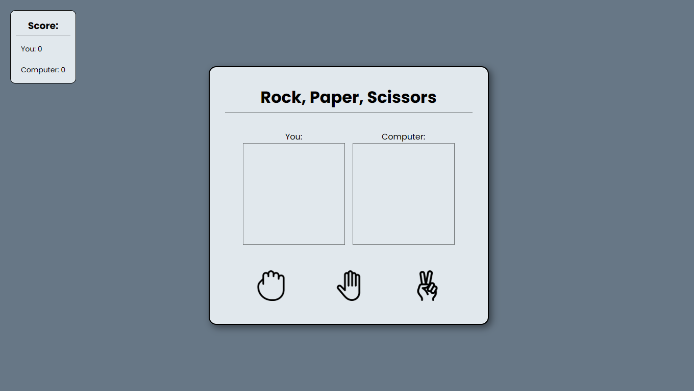

# Rock, Paper, Scissors

### About

Welcome to the development project of a rock, paper, scissors game using HTML, CSS, and JavaScript. This project was created with the aim of offering an interactive and enjoyable experience to players. Using web technologies such as HTML, CSS, and JavaScript, we have developed an intuitive interface that allows players to challenge the computer in a classic quick-choice game.

### Layout

### Technologies used

<ul>
    <li>HTML</li>
    <li>CSS</li>
    <li>JavaScript</li>
</ul>

### Author

<b>Marcos Ezequiel</b>

 &nbsp &nbsp &nbsp
 &nbsp &nbsp &nbsp
